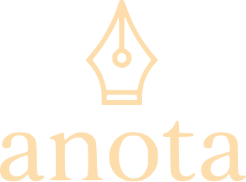

  

---

## O que é

O **anota** é um editor de texto colaborativo. Você acessa uma URL, escreve, e compartilha o link sem criar conta, sem instalar nada. Quem abrir o mesmo link vê o texto sendo digitado em tempo real.

## Funcionalidades

- Escreva em qualquer URL do tipo `anota-tau.vercel.app/seu-texto`
- Colaboração em tempo real com várias pessoas no mesmo link
- Proteja seus documentos com senha
- Gere um link aleatório com um clique
- Zero cadastro, zero rastreamento

## Como usar

### **1. Acesse o app**

Abra [anota-tau.vercel.app](https://anota-tau.vercel.app) no navegador.

### **2. Crie ou acesse um documento**

Digite o nome do seu documento no campo e clique em **ir** — ou deixe em branco para gerar um link aleatório.

A URL muda para algo como `anota-tau.vercel.app/meu-texto`. Qualquer pessoa com esse link pode abrir e editar junto com você.

### **3. Compartilhe**

Copie a URL do navegador e mande para quem quiser. Simples assim.

### **4. Proteja com senha (opcional)**

Clique no menu **≡** no canto superior esquerdo para abrir as configurações do documento. Lá você pode adicionar senha de leitura ou de edição.

---

feito por [Felipe Leite Conrado](https://github.com/FelipeLeiteConrado)

